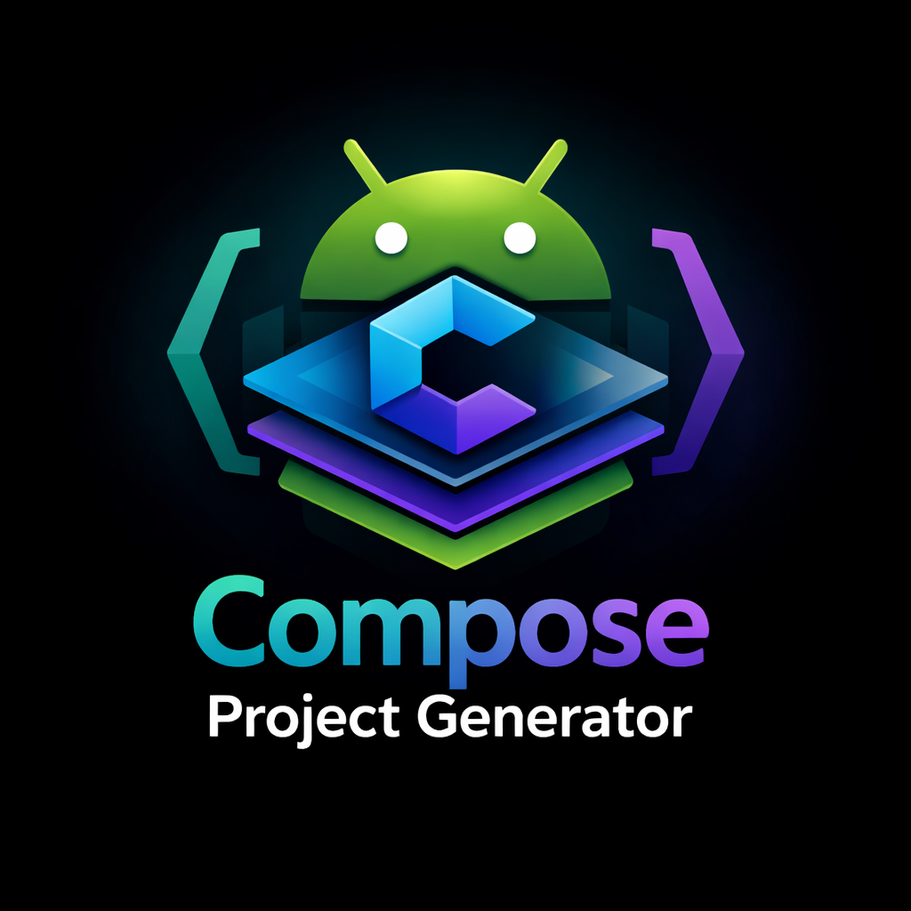

# Basic Compose Activity Plugin

  

  An Android Studio plugin that adds a <b>Basic Compose Activity</b> template to the New Project wizard.

  
  
  
  

---

## What is this?

This plugin adds a new project template -- **Basic Compose Activity** -- under the "Phone and Tablet" tab in Android Studio's New Project wizard. With one click you get a fully configured, multi-module Jetpack Compose project ready to build and run.

This is the **basic/starter version** of [MVVMTemplate](https://github.com/Drjacky/MVVMTemplate) and will be updated from time to time with the latest changes from that project.

## What you get

A generated project with:

- **Multi-module architecture** -- `app`, `build-logic/convention`, `core:common`, `core:domain`, `core:ui`, `feature:sample`
- **Jetpack Compose** with Material 3 and dynamic color
- **Navigation 3** -- type-safe compose navigation
- **Hilt** -- dependency injection with KSP
- **Convention plugins** -- shared build configuration via `build-logic`
- **Detekt** -- static code analysis with Compose rules
- **Gradle Version Catalog** -- centralized dependency management (`libs.versions.toml`)
- **Sample two-screen app** -- a list screen with a FAB navigating to an add screen, sharing a single ViewModel
- **Dependencies included** -- Coil, Lottie, LeakCanary, kotlinx-serialization, Accompanist, and more

## Installation

### From JetBrains Marketplace

1. Open Android Studio
2. Go to **Settings** > **Plugins** > **Marketplace**
3. Search for **Basic Compose Activity**
4. Click **Install** and restart

### From ZIP (local)

1. Clone and build: `./gradlew buildPlugin`
2. The ZIP is at `build/distributions/BasicComposeActivityPlugin-1.0.0.zip`
3. In Android Studio, go to **Settings** > **Plugins** > gear icon > **Install Plugin from Disk...**
4. Select the ZIP and restart

## Usage

1. Open Android Studio and select **New Project**
2. Under **Phone and Tablet**, select **Basic Compose Activity**
3. Configure your package name and project name
4. Click **Finish** -- the multi-module project is generated and Gradle sync starts automatically

## Contributing

Feel free to open an issue or submit a pull request for any bugs or improvements.

## License

This project is licensed under the Apache License 2.0 -- see the [LICENSE.md](LICENSE.md) file for details.
